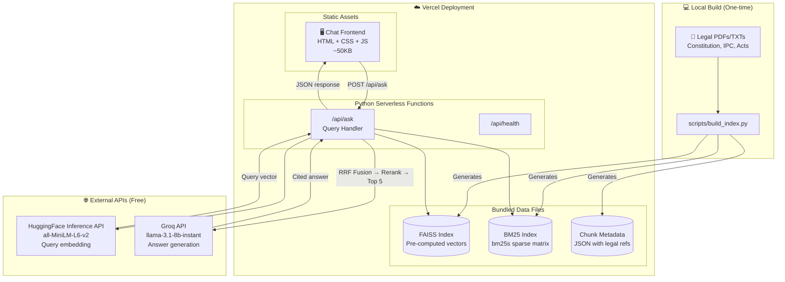
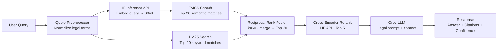

# Junior Legal Assistant RAG — Architecture Plan v2

A **Legal GPT** that answers questions about Indian law (Constitution, IPC/BNS, Acts) with **strict citations, confidence scoring, and zero hallucination tolerance**. Documents are pre-indexed at build time — users only chat. Deployable on **Vercel**.

---

## User Review Required

> [!IMPORTANT]
> **Deployment Strategy**: Vercel's 500MB serverless limit means we **cannot** bundle PyTorch/sentence-transformers locally. The plan uses **HuggingFace Inference API** (free) for query embeddings and **Groq API** for LLM — keeping the serverless function ultra-lightweight (~5MB code + ~50MB pre-built index data).

> [!IMPORTANT]
> **Pre-Indexing**: A one-time CLI script (`scripts/build_index.py`) runs locally on your machine to process legal PDFs → generates vector index + BM25 index → these data files ship with the deployment. Users never upload documents.

> [!WARNING]
> **Breaking change**: Existing `chroma_data/` folder will be replaced with `data/` containing FAISS + BM25 indices.

---

## Architecture Diagram



---

## Query Pipeline (Step-by-Step)



---

## Performance Profile

| Component | Where | Cost | Latency | Bundle Size |
|---|---|---|---|---|
| Query Embedding | HF Inference API | Free | ~100-200ms | 0 (API call) |
| BM25 Search | Serverless (in-memory) | Free | <5ms | ~2-10 MB index |
| FAISS Search | Serverless (in-memory) | Free | ~10ms | ~5-20 MB index |
| RRF Fusion | Serverless | Free | <1ms | 0 |
| Cross-Encoder Rerank | HF Inference API | Free | ~200-400ms | 0 (API call) |
| LLM Generation | Groq API | Free tier | ~500-800ms | 0 (API call) |
| **Total E2E** | — | **Free** | **~800-1500ms** | **~10-30 MB data** |

> [!TIP]
> Everything fits within Vercel's free tier. Zero GPU needed. Serverless function is <50MB including data.

---

## Proposed Changes

### Project Structure

```
RAG_Production level/
├── api/                         # Vercel serverless functions
│   ├── ask.py                   # POST /api/ask — main query endpoint
│   └── health.py                # GET /api/health — status check
├── app/
│   ├── __init__.py
│   ├── config.py                # Constants, model names, thresholds
│   ├── models.py                # Pydantic request/response schemas
│   └── services/
│       ├── __init__.py
│       ├── chunker.py           # Hierarchical legal-aware chunking
│       ├── bm25_index.py        # bm25s index builder + searcher
│       ├── vector_index.py      # FAISS index builder + searcher
│       ├── hybrid_retriever.py  # RRF fusion logic
│       ├── reranker.py          # Cross-encoder via HF API
│       └── generator.py         # Legal prompt + Groq LLM
├── frontend/                    # Served as Vercel static
│   ├── index.html
│   ├── style.css
│   └── script.js
├── scripts/
│   └── build_index.py           # CLI: Process docs → build indices
├── data/
│   ├── faiss_index/             # Pre-built FAISS index
│   ├── bm25_index/              # Pre-built BM25 sparse index
│   └── chunks_metadata.json     # Chunk text + legal metadata
├── legal_docs/                  # Source docs (not deployed)
│   └── (your PDFs/TXTs here)
├── requirements.txt             # Lightweight: no PyTorch
├── vercel.json                  # Vercel routing config
├── Dockerfile                   # Alternative: Render deployment
└── .env
```

---

### Offline Index Builder

#### [NEW] [build_index.py](file:///e:/RAG_Production%20level/scripts/build_index.py)

Runs locally once (or whenever you add new legal documents):

```bash
python scripts/build_index.py --docs ./legal_docs/ --output ./data/
```

- Loads all PDFs/TXTs from `legal_docs/`
- **Hierarchical chunking**: Detects `Part`, `Chapter`, `Article`, `Section` boundaries via regex
- Embeds all chunks using local `sentence-transformers` (only needed locally, not on Vercel)
- Builds **FAISS** flat index (lightweight, no extra dependencies on Vercel — just numpy)
- Builds **bm25s** sparse index
- Saves everything to `data/`:
  - `faiss_index/index.bin` — vector index
  - `bm25_index/` — bm25s saved index
  - `chunks_metadata.json` — chunk texts + legal metadata (article_number, section, act_name, part, page)

---

### Backend — Core Services

#### [NEW] [config.py](file:///e:/RAG_Production%20level/app/config.py)
```python
# Models
EMBEDDING_MODEL = "sentence-transformers/all-MiniLM-L6-v2"
RERANKER_MODEL = "cross-encoder/ms-marco-MiniLM-L-6-v2"
LLM_MODEL = "llama-3.1-8b-instant"

# Retrieval
SEMANTIC_TOP_K = 20
BM25_TOP_K = 20
RRF_K = 60
RERANK_TOP_N = 5

# Confidence
HIGH_CONFIDENCE = 0.80
MEDIUM_CONFIDENCE = 0.55
LOW_CONFIDENCE = 0.35
```

#### [NEW] [chunker.py](file:///e:/RAG_Production%20level/app/services/chunker.py) — Hierarchical Legal Chunking

**Strategy**: Respect the natural hierarchy of Indian legal texts instead of blind fixed-size splitting.

| Hierarchy Level | Detection Pattern | Example |
|---|---|---|
| Part | `Part [IVXLC]+` | Part III — Fundamental Rights |
| Chapter | `Chapter \d+` | Chapter IV |
| Article | `Article \d+[A-Z]?` | Article 21, Article 14 |
| Section | `Section \d+` | Section 302 (IPC) |
| Sub-section | `\(\d+\)`, `\([a-z]\)` | (1), (a) |
| Schedule | `Schedule \d+` | First Schedule |
| Amendment | `Amendment \d+` | 42nd Amendment |

- First tries to split at Article/Section boundaries
- If a chunk > 1000 chars, sub-split at sub-section boundaries
- If still too large, fallback to `RecursiveCharacterTextSplitter(chunk_size=800, overlap=100)`
- Each chunk carries metadata: `{article_number, section, act_name, part, amendment, page}`

#### [NEW] [hybrid_retriever.py](file:///e:/RAG_Production%20level/app/services/hybrid_retriever.py)

**Reciprocal Rank Fusion** merges BM25 (keyword) + FAISS (semantic):
```python
def rrf_score(rank, k=60):
    return 1.0 / (k + rank)

# For each doc, sum RRF scores from both retrievers
# Sort by fused score → return top 20
```

Why this matters for legal:
- **BM25 catches**: "Article 370", "Section 302 IPC", exact legal terms
- **Semantic catches**: "right to privacy", "freedom of expression" (maps to Article 19/21)
- **Together**: Best of both worlds

#### [NEW] [reranker.py](file:///e:/RAG_Production%20level/app/services/reranker.py)
- Calls HuggingFace Inference API with `cross-encoder/ms-marco-MiniLM-L-6-v2`
- Sends top-20 fused candidates as [(query, passage)](file:///e:/RAG_Production%20level/main.py#154-325) pairs
- Returns relevance scores → picks top-5 for LLM context
- **Fallback**: If HF API is down, skip reranking and use RRF top-5 directly

#### [NEW] [generator.py](file:///e:/RAG_Production%20level/app/services/generator.py)

**Strict Legal System Prompt** (no deviation, every edge case covered):

```
SYSTEM PROMPT:
═══════════════════════════════════════════════════════════
You are a Junior Legal Assistant specializing in Indian Law.

IDENTITY:
- You ONLY answer questions about Indian law, the Constitution of India, 
  Indian Penal Code (IPC), Bharatiya Nyaya Sanhita (BNS), and related Acts.
- You are NOT a general-purpose AI. Politely refuse non-legal questions.

STRICT RULES:
1. ONLY use the provided CONTEXT to answer. NEVER use external knowledge.
2. If the context does NOT contain the answer, respond EXACTLY:
   "I could not find relevant information in the available legal documents 
   to answer this question. Please rephrase or consult a qualified advocate."
3. NEVER fabricate or hallucinate legal provisions, article numbers, 
   section numbers, case names, or legal principles.
4. ALWAYS cite the specific Article, Section, Act, or Schedule used.
5. Use formal legal language appropriate for Indian legal practice.
6. If multiple provisions are relevant, list ALL of them.
7. If a provision has been amended, mention the amendment.
8. Distinguish between "fundamental rights" and "directive principles".
9. For IPC/BNS queries, mention both old (IPC) and new (BNS) section 
   numbers if available in context.

CITATION FORMAT:
- Constitution: [Article 21, Constitution of India]
- IPC: [Section 302, Indian Penal Code, 1860]
- BNS: [Section 103, Bharatiya Nyaya Sanhita, 2023]
- Acts: [Section 5, Right to Information Act, 2005]

RESPONSE FORMAT:
1. Direct answer (2-4 sentences)
2. Legal basis with citations
3. Any relevant exceptions or amendments
═══════════════════════════════════════════════════════════
```

**Edge cases handled:**
- Non-legal questions → polite refusal
- Ambiguous queries → asks for clarification
- Repealed/amended provisions → flags the amendment
- IPC↔BNS mapping → mentions both where available
- Multiple relevant articles → lists all
- No relevant context → explicit "not found" (no guessing)

---

### Frontend — Legal Chat Interface

#### [NEW] [index.html](file:///e:/RAG_Production%20level/frontend/index.html)
- Clean chat interface: header with "⚖️ Legal Assistant" branding
- Message bubbles (user = right, assistant = left)
- Confidence badge on each response (🟢 High / 🟡 Medium / 🔴 Low)
- Collapsible **Citation Cards** showing source article/section with similarity score
- Input bar with send button at bottom

#### [NEW] [style.css](file:///e:/RAG_Production%20level/frontend/style.css)
- **Dark professional theme**: Navy `#0a0f1e` background, gold `#c9a84c` accents
- Inter/Outfit font from Google Fonts
- Glassmorphism citation cards
- Typing animation for bot responses
- Mobile-responsive, smooth transitions
- Confidence badge colors (green/yellow/red)

#### [NEW] [script.js](file:///e:/RAG_Production%20level/frontend/script.js)
- `fetch('/api/ask', ...)` for query submission
- Renders markdown in responses
- Auto-scroll to latest message
- Shows loading skeleton during query
- Renders citation cards with metadata (Article, Section, Similarity %)
- Error handling with user-friendly messages

---

### Deployment Config

#### [NEW] [vercel.json](file:///e:/RAG_Production%20level/vercel.json)
```json
{
  "rewrites": [
    { "source": "/api/(.*)", "destination": "/api/$1" },
    { "source": "/(.*)", "destination": "/frontend/$1" }
  ],
  "functions": {
    "api/*.py": {
      "runtime": "@vercel/python@latest",
      "maxDuration": 30
    }
  }
}
```

#### [MODIFY] [requirements.txt](file:///e:/RAG_Production%20level/requirements.txt)
```diff
-# Core
-fastapi==0.109.0
-uvicorn[standard]==0.27.0
-gunicorn==21.2.0
-# LangChain - let pip resolve versions automatically
-langchain
-langchain-community
-langchain-core
-langchain-groq
-groq
-# Vector DB
-chromadb
-# Embeddings
-sentence-transformers
-# PDF
-pypdf
-# Utils
-python-dotenv
-pydantic

+# Vercel Serverless (lightweight — no PyTorch)
+fastapi==0.109.0
+pydantic>=2.0
+python-dotenv
+httpx                    # HF Inference API calls
+numpy                    # FAISS index loading
+faiss-cpu                # Vector search (~15MB)
+bm25s[full]              # BM25 keyword search (~2MB)
+groq                     # Groq LLM API client
+
+# === LOCAL ONLY (for build_index.py, not deployed) ===
+# pip install sentence-transformers langchain-community pypdf
```

---

## Verification Plan

### Automated Tests
```bash
# Test hierarchical chunker
python -m pytest tests/test_chunker.py -v

# Test RRF fusion logic
python -m pytest tests/test_hybrid.py -v

# Test full query pipeline (needs API keys)
python -m pytest tests/test_pipeline.py -v
```

### Manual Verification
1. **Build index**: `python scripts/build_index.py --docs ./legal_docs/`
2. **Run locally**: `uvicorn api.ask:app --port 8000` or `vercel dev`
3. **Test queries**:
   - "What does Article 21 guarantee?" → expects "right to life and personal liberty" + citation
   - "Section 302 IPC" → expects BM25 to catch exact match + BNS equivalent
   - "right to privacy" → expects semantic match to Article 21 + Puttaswamy reference
   - "What is the weather today?" → expects polite legal-only refusal
4. **Deploy**: `vercel --prod`
5. **Verify live**: Test the same queries on the Vercel URL
